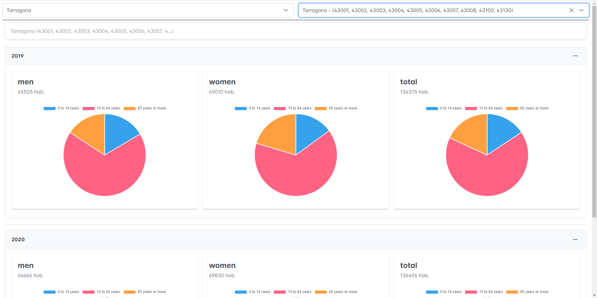
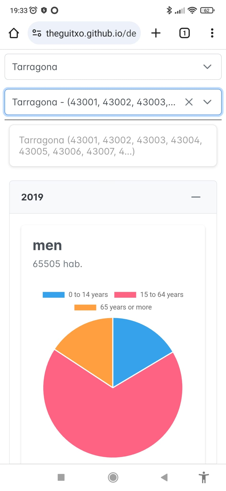

# Demography of Catalonia

This app shows information about the demography of Catalonia. You can filter data by province and city or village.

It's made with Angular (version 17). 
The data of the app are managed with NgRx:  [https://ngrx.io/](https://ngrx.io/).
The look and the charts are constructed with primeNG: [https://primeng.org/](https://primeng.org/).

## App run

* Clone the repository:

``` git clone https://github.com/theguitxo/demography.git ```

* Move to the project folder:

``` cd demography ```

* Run the dev server:

``` npm run start ```

* Navigate to: **http://localhost:4200**

## Demo

You can see a demo of this app here:

[https://theguitxo.github.io/demography/](https://theguitxo.github.io/demography/)

## Screenshots

### Desktop



### Mobile


